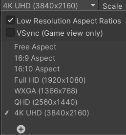
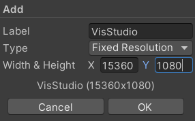
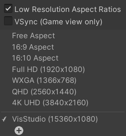

**Setting up your project**

First and foremost, you are going to need a Unity project to use the camera in. The camera system was developed for Unity Version 2021.3.4f1. If you already have a project created and you are adapting it for the Visualization Studio, that is perfectly fine. Just know that some of the instructions provided may differ if you are using a different version of Unity. We have done our best to keep the instructions general, but images and videos may not reflect your Unity setup.

---

**Download the 3D camera package**

Below you will find the link to a github repo with the camera packages. You will want to download the package titled (insert title here).

* (Provide link here)

---

**Switching to the Universal Render Pipeline**

The ```Universal Render Pipeline``` was utilized to make the camera function properly within the Visualization Studio. Universal Render Pipeline can be installed through Unity's ```Package Manager```.

To configure your project to use Universal Render Pipeline we recommend that you follow the instructions found [here](https://www.tomstephensondeveloper.co.uk/post/unity-universal-render-pipeline-urp-initial-setup) as they walk you through every aspect of the configuration.

---

**Custom Resolution**

In order for the camera system to function properly, you are going to need to set up a custom resolution for your display. While the Visualization Studio is an array of 8 projectors, what is displayed is considered one screen with a resolution of 15360x1080.

To set up a custom resolution, you will need to go to the game view screen in the Unity Editor.


Next to the dropdown labeled Display 1, you will find another dropdown with the aspect ratios.


At the bottom of that dropdown, there is an option to create a custom resolution profile. Click on that.



You can name the profile whatever you choose. For the purposes of this instruction, we will name it "VisStudio".


Keep the selection of Fixed Resolution and in the fields below, set the width to be ```15360``` and the height to be ```1080```.



Save the resolution and make sure that it is the one selected from the dropdown.

