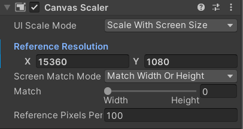

## Making Scenes for the Visualization Studio

---

### Full Utilization of the Screen

When developing 2D scenes for the Visualization Studio, one of the main challenges you will face is what to do with the point where the right edge of the screen meets the left edge of the screen. What is displayed when running your scene is one continuous screen, so you must think about how it all blends together at that point. Keeping this in mind from the start will help you make decisions about how you will develop your scene and what you can and cannot do with your scene.

For some reference scenes that take show some of the ways to work with this edge zone, take a look at this suite of demos: (Insert Hank's Haven link).

---

### UI

When working with UI for the Visualization Studio in Unity, each Canvas that you create will need to be told to use the correct screen resolution. To do this, select your UI Canvas from the Hierarchy and then in the inspector, find and expand the ```Canvas Scalar``` component. Change the ```UI Scale Mode``` to be ```Fit to Screen``` and change the ```Reference Resolution``` to be 15360x1080.



---

## Final Words

Once you have ensured that your scene is configured properly for 2D in the Visualization Studio, then your 2D project should be ready to be used within the Visualizaiton Studio. (Please note that you will not be able to see how your project looks in the Visualization Studio unless you build and run the project in the space).

In order to schedule time to test your project within the Visualization Studio, please follow the instructions here (```Insert link here```).
